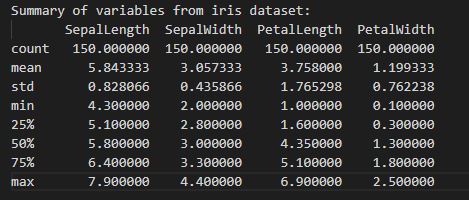
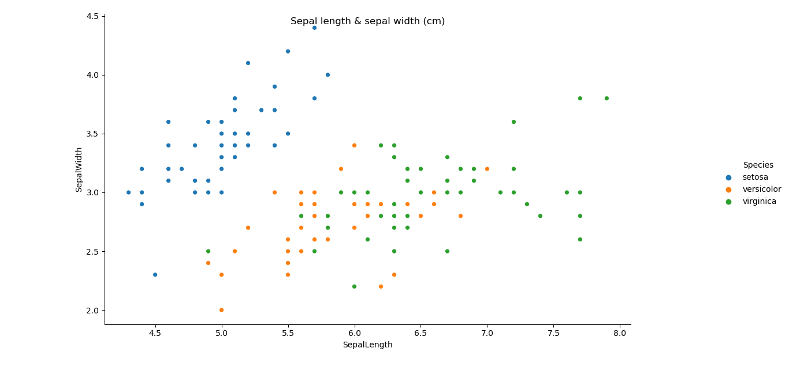

# Programming and Scripting Project 2020 

This document contains a summary of my efforts to complete the final project for the Programming and Scripting module, along with observations  about the dataset and the references used to complete it. 

## Project Abstract 

My goal with this project is to analyze the Fisher’s Iris data set and reach to a set of conclusions using Python. In order to analyze this dataset, I will use the knowledge I have gained during the completion of this module along with extra resources which I will document here for reference.  

[Iris Data set in CSV format downloaded from this link](https://gist.github.com/netj/8836201)  

## Summary of dataset  

**1.History:**

This dataset was created in 1936 by the British statistician and biologist Ronald Fisher.
The set is composed of a total of 150 instances, 50 for each of the 3 species which refer to a type of iris plant (iris setosa, iris versicolor & iris virginica). 

  
  
  

For those who are not familiar with the two main concepts of this dataset, see definitions below:

*Sepal: This is one of the parts of the flower which forms the outer part surrounding the petals.*
*Petal: This part of the flower consists of the brightly coloured parts that together will form most of the flower.* 

**2.Data set variables:** 

The way the date is organised is as follows:  
There are four columns with the different flower parts measures in centimetres and the fifth column is the species of the flower observed.
 
*Variables:*  

SepalLength (This is the length of the sepal of flower in cm)
SepalWidth (This is the width of the sepal of the flower in cm)
PetalLength (This is the length of the petal of the flower in cm)
PetalWidth (This is the width of the petal of the flower in cm)
Species (Species name)

**3. Project process:**    

In order to create this project I have divided my work into smaller separate tasks until I was ready to join all and create last version of "Analysis.py". I have also planned my tasks using Github planning and Milestone tools as you can see in this repository.
My approach was to include these small tasks into different stages with a date to be completed and then follow with the next phase or stage, I created 3 phases with 3 specific milestones. See details of these phases below for reference:  

1.	Phase 1. Documentation  
2.	Phase 2. I created separate programs to achieve the 3 main tasks and I observe other author’s analysis of this dataset as documented in references section.    
3.	Phase 3. I put together the tasks to create Analysis.py and added my observations and information into this document.  

**4.Summary statistics table:**  

The first task was to organise the data and have a look into its distribution. I used command df.describe() to see a Summary statistics table to see what is the mean, std, minimum and maximum values within the different variables etc. The generated document containing this summary can be found in this repository as "Summary.txt", I have also included here as an image for reference:  

  
 
Looking at these values, we ca see that there is a extensive range concerning sepal and petal sizes, our goal with this analysis is to determine if is possible to classify the three iris species by their parts measurements.

**5.Histogram:**  

Following the procedure and guidelines provided, the second part of the tasks that Analysis.py performs is saving an histogram of every variable into a png file.  
An histogram is a type of graph used to represent the data distribution by using bins along the range of the data and then drawing bars to show the number of observations that fall in each bin. For the creation of these histograms I have used *matplotlib* , *pandas* and *seaborn* libraries. I have selected *seaborn* libraries to give some more dimension to my plots as it includes nice looking graphics.  

In order to move along within the Analysis you just need to get to the histogram section and create the file, for this I used command savefig and add name of the png file.The png file is added to this repository in the images folder as reference.  
Instead of creating a individual file for every histogram I have added the four histograms to a single graphic which will be saved as a single png by the program.

*4 variables histogram*

  

 
With the histogram we can see the range of values for every of the four variables ( sepal length, sepal width, petal length and petal width).  

I have also added an histogram that shows the variables and species category in the same plot , as a reference to see the difference in distribution within the three types of iris flowers.  

  
  
  
  

Observing these histograms we can already see at first glance how some of the species have very different range of values in some of their attributes, for example setosa in relation to the other two types of iris flowers, seems to have smaller petals.  

**6.Scatter plot:**  

After the histogram section we move down to the scatter plot representation of this data. I have created two scatter plots combining two variables ( sepal length & sepal width) and (petal length & petal width) and separating by species using color. Scatter plots are an useful type of graphic when we want to see the relation between two variables.
 
Observing the first scatter plot, we can see that it seems to be a clear difference between the setosa species and the other two. Setosa iris flowers seem to have wider sepals than the versicolor and virginica species, while the other two species seem to have longer sepals.  

  

On the other hand the second scatter plot we can spot that setosa species seem to have shorter and narrower petals than the other two species.  
  

 
**7.Conclusions:** 

Observing these  graphic representations above we can reach the following conclusions in relation to this data set:  

-Versicolor and virginica species of iris flower seem to be in general bigger in terms of petal size, with virginica having the widest and longest petal sizes, while setosa is clearly smaller and narrower.  

-In sepal size terms, we have wider and shorter sepals in setosa species. For versicolor and virginica , sepals size seems to be similar.  

•	We could try to determine if an iris flower belongs to setosa species looking at its parts measurements specially petal length.

**References:**  
[Dataset history and details](https://archive.ics.uci.edu/ml/datasets/Iris)    
[Dataset analysis](https://www.kaggle.com/uciml/iris)   
[Flower parts definitions](https://dictionary.cambridge.org/dictionary/english/)    
[Dataset extracted from this resource](https://gist.github.com/netj/8836201)  
[Histogram tutorial in Seaborn](https://www.tutorialspoint.com/seaborn/seaborn_histogram.htm)  
[Seaborn color palettes](https://seaborn.pydata.org/tutorial/color_palettes.html)  
[Several variables histogram with Seaborn](https://python-graph-gallery.com/25-histogram-with-several-variables-seaborn/)  

